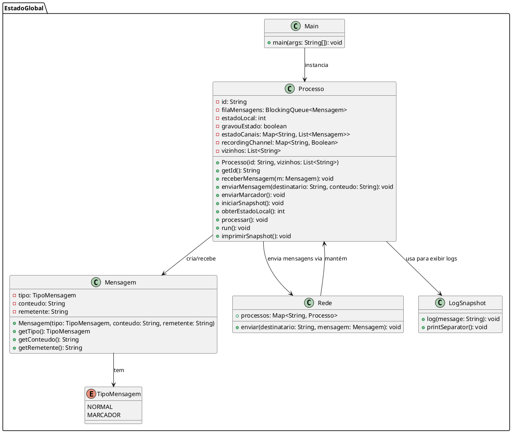
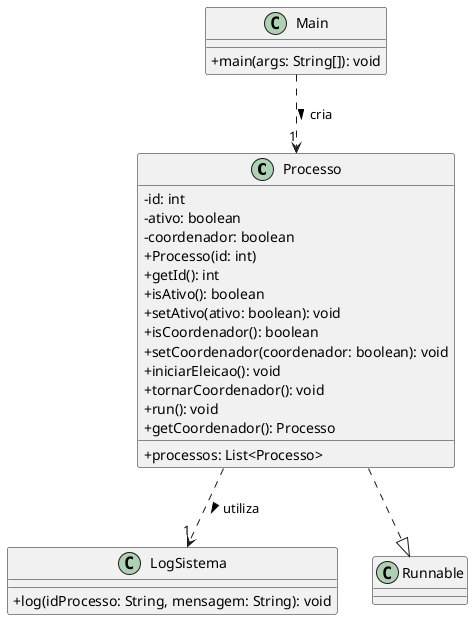
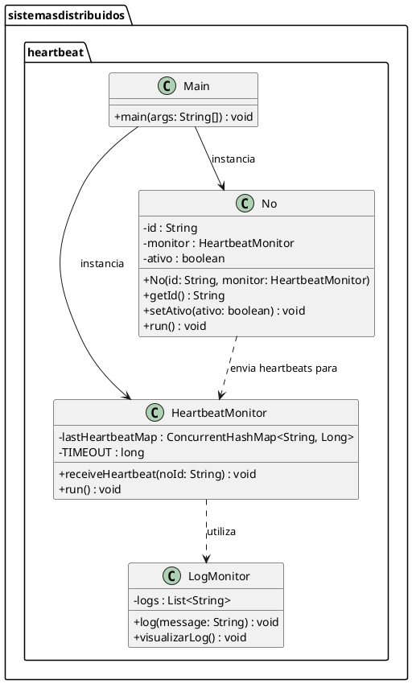

## Relógio de Lamport

O algoritmo de Lamport define um relógio lógico para ordenar eventos em sistemas distribuídos sem depender de relógios físicos. Cada processo mantém um contador que é incrementado em eventos locais e atualizado (comparando e somando 1) ao receber mensagens. Isso garante que a ordem causal entre os eventos seja preservada, mesmo sem uma sincronização física dos relógios.

### Estrutura: 

```plantuml
@startuml
package RelogioLamport {
  
  class RelogioLamport {
    - tempo : int
    + RelogioLamport()
    + incrementar() : int
    + atualizar(tempoRecebido : int) : int
    + getTempo() : int
  }
  
  class Mensagem {
    - timestamp : int
    - conteudo : String
    - origem : String
    + Mensagem(timestamp : int, conteudo : String, origem : String)
    + getTimestamp() : int
    + getConteudo() : String
    + getOrigem() : String
  }
  
  class No {
    - nome : String
    - relogio : RelogioLamport
    - filaMensagens : BlockingQueue<Mensagem>
    + No(nome : String)
    + eventoLocal(descricaoEvento : String) : void
    + enviarMensagem(destinatario : No, conteudo : String) : void
    + receberMensagem(mensagem : Mensagem) : void
    + processarEventos() : void
  }
  
  class Main {
    + main(args : String[]) : void
  }
  
  // Relações
  No --> RelogioLamport : usa
  No --> Mensagem : cria / recebe
  Main --> No : instancia
}
@enduml
```


## Chandy-Lamport

Este algoritmo é usado para capturar o estado global (snapshot) de um sistema distribuído sem interromper sua execução. Um processo inicia o snapshot registrando seu estado local e enviando um marcador para os outros processos. Ao receber o marcador pela primeira vez, cada processo registra seu estado e começa a gravar as mensagens que chegam pelos canais até receber um marcador em cada canal. Assim, o snapshot global consiste no conjunto dos estados locais e dos estados dos canais (mensagens em trânsito).

### Estrutura: 



## Bully

No algoritmo Bully, cada processo possui um identificador único e pode se tornar o coordenador (líder). Quando um processo detecta que o coordenador falhou, ele inicia uma eleição enviando mensagens para processos com IDs maiores. Se nenhum processo com ID maior responder, ele se declara o coordenador e notifica os demais. Em cenários de falhas e recuperações frequentes, mecanismos de espera e reconfirmação podem ser implementados para reduzir instabilidade antes de iniciar uma nova eleição.

### Estrutura: 



## Heartbeat

Neste mecanismo, cada nó envia periodicamente uma mensagem (heartbeat) para um monitor central. O monitor registra o último timestamp recebido de cada nó e verifica periodicamente se o tempo decorrido ultrapassa um limite definido. Caso um nó não envie heartbeat dentro do prazo (timeout), ele é considerado falho. Em versões aprimoradas, o nó que falhou pode tentar se reconectar automaticamente, permitindo sua reintegração ao sistema sem intervenção manual.

### Estrutura: 



## Como executar os testes: 

#### 1. Abra o terminal e execute o comando abaixo para clonar o projeto:
```git clone https://github.com/adrianovictorn/SDI.git ```

#### 2. Entre na pasta do projeto:
```cd SDI```

#### 3. Compilar o Código:
```javac -d bin src/NomeDaPasta/*.java```


### Relatório:

```https://docs.google.com/document/d/1-bIeZvtYItGwD84XZXQEC0eI_OXdb_K0etlvfzFWmQg/edit?usp=sharing ```


### Referências: 

- GEEKSFORGEEKS. Chandy-Lamport’s Global State Recording Algorithm. Disponível em: https://www.geeksforgeeks.org/chandy-lamports-global-state-recording-algorithm/. Acesso em: 22 fev. 2025.

- VADO. node260.html. Disponível em: https://homepages.dcc.ufmg.br/~vado/cursos/progpar982/curso/node260.html#SECTION04310100000000000000. Acesso em: 22 fev. 2025.

- VINIBIAVATTI1. Bully [repositório GitHub]. Disponível em: https://github.com/vinibiavatti1/Bully/tree/master/src/geral. Acesso em: 22 fev. 2025


